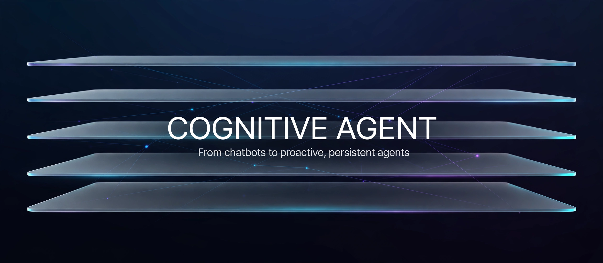
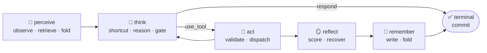
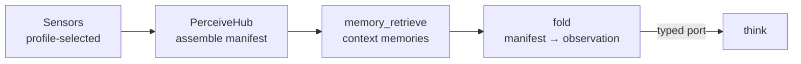
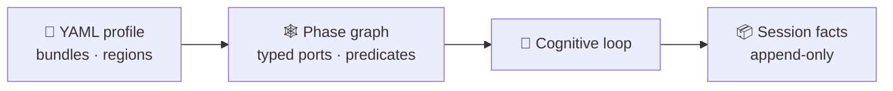

<p align="center">
  
</p>

<h1 align="center">Cognitive Agent</h1>

<p align="center">
  <b>A Python framework for building agents with real cognitive architecture — memory, planning, reflection — not just an LLM wrapped in a chat loop.</b>
</p>

<p align="center">
  <a href="https://www.python.org/"></a>
  <a href="LICENSE"></a>
  <a href="docs/adr/README.md"></a>
  <a href="docs/adr/0194-cognitive-loop-architecture-convergence.md"></a>
</p>

<div align="center">



</div>

<p align="center">
  📖 Start with the <a href="docs/adr/README.md">architecture decisions</a> or jump to <a href="#quickstart">quickstart</a>
</p>

<br>

---

## Why not just a prompt loop?

Most agent frameworks give you a prompt loop and call it an agent. Here, every turn is a **typed, inspectable cognitive pipeline** — six phases, each a graph node with declared inputs, outputs, and guard predicates.

**Perception is architecture, not an afterthought.** A dedicated perceive phase runs before every thought: profile-selected sensors assemble into a `PerceiveHub`, observations fold with retrieved memories into one typed `observation` port.



**Cognition computes — it never writes.** Thinking and doing are strictly separated: phases compute decisions, only the loop performs side effects through typed ports. No hidden state mutations inside "reasoning" code.

**Memory is a phase, not a plugin.** `remember` runs every turn — decisions, observations, and reflections fold into memory with a `memory_receipt`. Persistence is in the topology, not bolted on.

**Profiles compile to graphs.** Agents are declared in YAML profiles and compiled into executable phase graphs with typed ports and predicate-guarded edges. Swap a profile, get a different agent:



<br>

---

## Architecture

Five layers, strict one-way dependencies — a lower layer never depends on an upper one:

| Layer | Responsibility | Examples |
|---|---|---|
| L4 Application / Orchestration | Minimal developer API; the composition root | `Agent`, `Team`, `TeamLead` |
| L3 Agent Abstraction | Agent lifecycle & team orchestration | `BaseAgent`, `Supervisor`, `TeamOrchestrator` |
| L2 Cognitive Runtime | The core loop | `CognitiveRuntime`, `StrategyRegistry`, Hooks |
| L1 Cognitive Components | Independently testable cognitive modules | Brain / Body / Memory / EventBus |
| L0 Infrastructure | LLM adapters, tool protocols, state management | `LLMAdapter`, `ToolProtocol`, `StateStore` |

Runtime kernel in `lca_kernel/`, framework in `lca/`. Rationale: [ADR-0001](docs/adr/0001-five-layer-separation.md).

<br>

---

## Quickstart

Requires Python 3.11+.

```bash
git clone https://github.com/agents-builders/cognitive-agent.git
cd cognitive-agent
pip install -e .   # or: uv sync
```

```python
from lca import Agent, Team  # facade API, resolved lazily
```

Run the tests:

```bash
pytest tests/ -q
```

> [!NOTE]
> The framework is under active development — `docs/` and `AGENTS.md` describe the current API surface.

<br>

---

## Documentation

| Looking for | Where |
|---|---|
| Architecture Decision Records | [docs/adr/README.md](docs/adr/README.md) |
| Repo contract for coding agents (read first) | [AGENTS.md](AGENTS.md) |
| Documentation map | [docs/specs/documentation-map.md](docs/specs/documentation-map.md) |
| Engineering guardrails | [docs/agent-contract/coding-guardrails.md](docs/agent-contract/coding-guardrails.md) |
| Framework source | `lca/` · kernel `lca_kernel/` · tests `tests/` |

Every significant design choice has an ADR. If you're wondering *why* something is built the way it is, start there.

<br>

---

## Contributing

Issues and pull requests are welcome. Read [AGENTS.md](AGENTS.md) first — layering rules, commit conventions, and quality bars (green tests are the definition of done).

<br>

---

<p align="center">
  <sub>MIT — see <a href="LICENSE">LICENSE</a></sub>
</p>
