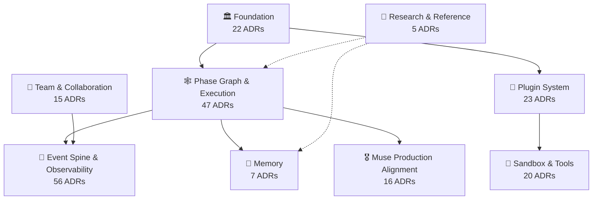

# Architecture Decision Records

> Every significant design choice in this project is recorded here — the *why* behind the *what*.

Newest decisions live at the highest numbers. Statuses: ✅ accepted and in force · 📝 proposed · 🔄 superseded · ✔️ implemented.

## 🗺️ Decision landscape

## 🧭 Start here

New to the project? These ten trace the core ideas end to end:

1. [0001](0001-five-layer-separation.md) — **Five-Layer One-Way Dependency Separation** (the layering everything else obeys)
2. [0008](0008-framework-positioning.md) — **Framework Positioning and Differentiation** (why this project exists and how it differs)
3. [0004](0004-protocol-first-pluggability.md) — **Protocol-First Pluggable Design** (the pluggability philosophy: protocols, not base classes)
4. [0005](0005-composition-root-l4.md) — **L4 Composition Root: Three-Responsibility Pattern** (the L4 composition-root pattern)
5. [0075](0075-declarative-phase-graph-and-minimal-trusted-kernel.md) — **Declarative Phase Graph and Minimal Trusted Kernel** (the phase-graph vision and minimal trusted kernel)
6. [0194](0194-cognitive-loop-architecture-convergence.md) — **Cognitive Loop Convergence: Graph Kernel, Six Phases** (the current architecture: graph kernel, six phases)
7. [0206](0206-information-graph-kernel.md) — **Compilable Information-Graph Cognitive Kernel** (where the kernel is heading: a compilable information graph)
8. [0037](0037-journal-as-truth.md) — **Journal-as-Truth; Spans Demoted to Projections** (journal-as-truth: the event-log philosophy)
9. [0186](0186-session-as-event-ssot.md) — **Session as Event SSOT: Append, Observe, Fold** (session as the event source of truth)
10. [0255](0255-muse-production-runtime-full-reference.md) — **Muse Production Runtime: Full Reference Spec** (the production-runtime reference spec)

## 📖 Index by theme

Click a theme to expand. Every ADR number links to its document.

<b>🏛️ Foundation</b> — 22 ADRs · layering, the cognitive loop, protocols, composition root

| ADR | Title | Status |
|---|---|---|
| [0001](0001-five-layer-separation.md) | Five-Layer One-Way Dependency Separation | ✅ Accepted |
| [0002](0002-cognitive-loop.md) | Six-Step Cognitive Closed Loop | 🔄 Superseded |
| [0004](0004-protocol-first-pluggability.md) | Protocol-First Pluggable Design | ✅ Accepted |
| [0005](0005-composition-root-l4.md) | L4 Composition Root: Three-Responsibility Pattern | ✅ Accepted |
| [0007](0007-interop-mcp-a2a.md) | Native Interop Protocol Layer (MCP/A2A) | ✅ Accepted |
| [0008](0008-framework-positioning.md) | Framework Positioning and Differentiation | ✅ Accepted |
| [0015](0015-contracts-no-behavior-classes.md) | contracts/: Types and Interfaces Only | ✅ Accepted |
| [0079](0079-ci-four-layer-test-discipline.md) | CI Four-Layer Test Discipline | 📝 Proposed |
| [0103](0103-locked-surface-and-port-policy.md) | Locked Surface and Port Policy | ✅ Accepted |
| [0104](0104-semantic-layer-rename.md) | Semantic Renaming of lca Top-Level Package | 📝 Proposed |
| [0105](0105-package-organization-discipline.md) | Python Package Organization Discipline (8/10/15 Rule) | 📝 Proposed |
| [0106](0106-naming-constitution.md) | Naming Constitution (v3) | 📝 Proposed |
| [0108](0108-phase-de-and-e.md) | Phase D/E Closeout: CI Gates, README, Cleanup | ✅ Accepted |
| [0111](0111-startup-compilation-as-subpackage.md) | Compile Startup Chain into lca-kernel Top Package | ✅ Accepted |
| [0115](0115-kernel-transport-boundary.md) | Kernel/Transport Boundary; lint-imports Gate | ✅ Accepted |
| [0117](0117-process-lifecycle-env-whitelist.md) | Process Lifecycle, Fail-Loud, Env Whitelist | ✅ Accepted |
| [0118](0118-kernel-hmr-patch-watcher.md) | Kernel HMR: Live Patches via cordis.patch.yml | ✅ Accepted |
| [0195](0195-platform-architecture-convergence.md) | Full-Stack Platform Convergence (Kernel/Transport/Observability) | ✔️ Implemented |
| [0200](0200-p1-agent-gateway-bridge.md) | P1 Agent Gateway Bridge (WebSocket + Redis Stream) | ✅ Accepted |
| [0202](0202-transport-ui-env-ssot.md) | Transport/UI Env Config SSOT; Retire os.environ Reads | 📝 Proposed |
| [0213](0213-kernel-serve-spawn-result-and-health-readiness.md) | KernelServe Spawn State Machine; /health Readiness | ✔️ Implemented |
| [0252](0252-multi-user-onboarding-and-identity.md) | Multi-User Onboarding and Identity Isolation | ✔️ Implemented |

<b>🕸️ Phase Graph & Execution</b> — 47 ADRs · six-phase graph, bundles, typed ports, perceive / think / act

| ADR | Title | Status |
|---|---|---|
| [0045](0045-decision-canonical-intent-shape.md) | Decision Intent Shape Canonicalization | ✅ Accepted |
| [0073](0073-runsession-sole-session-path.md) | Session Path Convergence | 📝 Proposed |
| [0075](0075-declarative-phase-graph-and-minimal-trusted-kernel.md) | Declarative Phase Graph and Minimal Trusted Kernel | 📝 Proposed |
| [0077](0077-terminal-outcome-protocol.md) | TerminalOutcome Protocol as Sole Terminal Truth | 📝 Proposed |
| [0078](0078-hil-approval-state-machine.md) | HIL Approval as First-Class State Machine | 📝 Proposed |
| [0086](0086-retire-unconsumed-loop-topology.md) | Retire Unconsumed LoopTopology Production Closure | ✅ Accepted |
| [0087](0087-runtime-boundary-cohesion.md) | Runtime Boundary Cohesion; Split Legacy Run Registry | ✅ Accepted |
| [0088](0088-profile-selected-runtime-factory.md) | Profile-Selected Full Agent Loop Runtime | ✅ Accepted |
| [0089](0089-composable-phase-observation.md) | Composable Declarative Phase Observation | ✅ Accepted |
| [0090](0090-session-turn-task-controller.md) | Session-Level Turn Task Controller | ✅ Accepted |
| [0091](0091-profile-selected-followup-dispatch.md) | Profile-Selected Follow-up Dispatch and Reliable Queue | ✅ Accepted |
| [0093](0093-continuous-control-plane.md) | Continuous Execution Control Plane | 📝 Proposed |
| [0094](0094-stop-policy-locality.md) | StopPolicy State-Group Locality | 🔄 Superseded |
| [0095](0095-loop-guard-locality.md) | LoopGuard Interpreter Locality | ✅ Accepted |
| [0100](0100-chat-command-is-agent-run.md) | Chat Commands Are Agent Runs, Not Completions | ✅ Accepted |
| [0169](0169-loop-cursor-control.md) | LoopCursor Control-Plane Convergence; Separate Observability | 📝 Proposed |
| [0171](0171-fork-shared-host.md) | Fork Shared-Host Protocol; No Independent Child Host | 📝 Proposed |
| [0173](0173-halt-resume-protocol.md) | Halt-Resume Protocol; LoopCursor Rescue Path | 📝 Proposed |
| [0174](0174-profile-cursor-bundles.md) | Profile Staged Assembly; loop_cursor.spine_* Bundles | 📝 Proposed |
| [0191](0191-runtime-loop-dsh-convergence-and-control-plane.md) | Runtime Loop DSH Convergence; Keep LCA Control Plane | ✔️ Implemented |
| [0194](0194-cognitive-loop-architecture-convergence.md) | Cognitive Loop Convergence: Graph Kernel, Six Phases | ✔️ Implemented |
| [0196](0196-convergence-control-plane-and-prompt-surface.md) | Convergence Control Plane and PromptSurface SSOT | ✔️ Implemented |
| [0197](0197-guard-stack-hermes-dsh-convergence.md) | Guard Stack: Hermes Layers + DSH Guard Plugins | ✔️ Implemented |
| [0206](0206-information-graph-kernel.md) | Compilable Information-Graph Cognitive Kernel | 📝 Proposed |
| [0207](0207-graph-orchestrated-cognitive-agent-kernel.md) | Graph-Orchestrated Cognitive Kernel (Merged into 0206) | 🔄 Superseded |
| [0210](0210-stage-closure-migration-p7.md) | Stage-Closure Migration: Phases Degrade to region Labels | ✅ Accepted |
| [0217](0217-bundle-graph-schema-v2.md) | Bundle Graph Schema v2 (factory→plugin Resolution) | ✅ Accepted |
| [0218](0218-bundle-graph-v2-subgraph-driver.md) | Bundle Graph v2 Subgraph Driver | ✅ Accepted |
| [0219](0219-phase-graph-unification.md) | Phase-Graph Unification: Single-Responsibility Regression | 📝 Proposed |
| [0220](0220-three-tier-graph-and-boundary-typing.md) | Three-Tier Graph Concepts; Boundary Typed DTOs | 📝 Proposed |
| [0221](0221-concept-decision-classify-parse-merge.md) | Merge concept.decision.classify Parse Nodes | 📝 Proposed |
| [0225](0225-drop-max-visits-graph-invariant.md) | Drop max_visits Graph-Topology Invariant | ✔️ Implemented |
| [0227](0227-graph-node-dsl.md) | @graph_node DSL (Retired; Use @plugin Carrier) | 🔄 Superseded |
| [0228](0228-plan-intervene-delegate-subgraphs.md) | plan/intervene/delegate Subgraphs; Retire @graph_node | ✅ Accepted |
| [0230](0230-stop-decision-retirement.md) | Stop-Decision Retirement; terminal.commit Replaces stop.main | ✔️ Implemented |
| [0231](0231-region-prefix-ssot-and-node-directory-canonicalization.md) | Region Prefix SSOT: lca/nodes/<region>/ Directory | ✅ Accepted |
| [0232](0232-act-fanout-n-to-n-and-parallel-tool-batch.md) | act.fanout N:N; Parallel Default for Read-Only Tools | ✅ Accepted |
| [0233](0233-c11-escape-hatch-policy.md) | C11 Escape-Hatch Policy; spine.* Raise-Loud | ✅ Accepted |
| [0234](0234-effect-pre-dispatch-envelope-check.md) | Effect Pre-Dispatch Envelope Check as Graph Node | ✅ Accepted |
| [0235](0235-act-envelope-typed-port-hygiene.md) | act.envelope Typed-Port Hygiene (C13) | ✅ Accepted |
| [0236](0236-dual-lineage-retirement.md) | Dual Lineage Retirement | ✅ Accepted |
| [0237](0237-subgraph-output-bubble-outer-edge-exclusivity.md) | Subgraph Output Bubbling; Outer Edge Exclusivity | ✅ Accepted |
| [0268](0268-context-bus-async-executors-and-cron-projection.md) | Context Bus, Four Async Executors, Cron Projection | 📝 Proposed |
| [0273](0273-streaming-interleave-think-act.md) | Streaming Interleave: think Streams, act Preps | 📝 Proposed |
| [0274](0274-phase-wire-budget.md) | Phase Wire Budget Contract | 📝 Proposed |
| [0275](0275-window-pressure-phase-degradation.md) | Window-Pressure Phase Degradation Contract | 📝 Proposed |
| [0278](0278-scheduler-mutual-exclusion-convergence.md) | Dual Scheduler Mutual-Exclusion Convergence | 📝 Proposed |

<b>📡 Event Spine & Observability</b> — 56 ADRs · journal-as-truth, execution points, traces, projections

| ADR | Title | Status |
|---|---|---|
| [0037](0037-journal-as-truth.md) | Journal-as-Truth; Spans Demoted to Projections | ✅ Accepted |
| [0038](0038-llm-stream-event-contract.md) | LLMAdapter Streaming Event Contract | ✅ Accepted |
| [0041](0041-prompt-reasoner-stream-text-delta.md) | PromptReasoner Streaming Text Deltas; Frontend Projection | 📝 Proposed |
| [0055](0055-run-fact-store.md) | Run Fact Store: Immutable Events for Telemetry | ✅ Accepted |
| [0063](0063-run-trace-ssot.md) | Run Trace SSOT: Journal Facts + Pluggable Projections | ✅ Accepted |
| [0065](0065-recoverable-evidence-ledger.md) | Recoverable Evidence-Preserving Run Ledger | ✅ Accepted |
| [0092](0092-durable-session-command-ledger.md) | Durable Session Command Ledger | ✅ Accepted |
| [0096](0096-journal-protocol-layer-everything-pluggable.md) | Journal Protocol Layer: Everything Pluggable | 📝 Proposed |
| [0097](0097-event-identity-derivation.md) | Event Identity Derivation via ULID | 🔄 Superseded |
| [0098](0098-session-spine-deltas.md) | SessionEvent Causal Deltas; Dual Projection Channels | 🔄 Superseded |
| [0099](0099-runs-live-openai-stream.md) | Converge /runs/{id}/live to OpenAI Streaming | 🔄 Superseded |
| [0101](0101-followup-tool-call-streaming-partial-preview.md) | Followup: Tool-Call Streaming Partial Preview | 📝 Proposed |
| [0113](0113-boot-trace-first-class-citizen.md) | Boot Trace as First-Class Citizen + Sink Seam | 🔄 Superseded |
| [0114](0114-boot-event-catalog-increment.md) | Boot Event Catalog: Five New Boot Events | 🔄 Superseded |
| [0116](0116-boot-event-observability-convergence.md) | Boot Event Catalog and Observability Convergence | ✅ Accepted |
| [0122](0122-plugin-native-debug-observability.md) | Plugin-Native Debug and Observability | ✅ Accepted |
| [0156](0156-eliminate-projection-and-progress-leakage.md) | Eliminate Three Leaks: Facts/Progress, Projection, Phase | ✅ Accepted |
| [0157](0157-progress-stream-and-retire-toolcallstreaming.md) | Progress Stream; ToolCallStreaming Merge by ID | ✅ Accepted |
| [0158](0158-projection-isolation-and-finalizer-cleanup.md) | Projection Isolation and Finalizer Cleanup | ✅ Accepted |
| [0159](0159-phase-factsensor-and-tool-lifecycle-events.md) | Phase FactSensor and Tool Lifecycle Events | ✅ Accepted |
| [0160](0160-llm-call-stream-finalize-on-exit.md) | Revoke LLM finalize-on-exit; TelemetryLLMAdapter Closed It | ✅ Accepted |
| [0161](0161-step-advance-on-phase-retry.md) | Revoke Step Advance on Phase Retry | ✅ Accepted |
| [0162](0162-fact-vs-progress-judgment-criterion.md) | Fact-vs-Progress Judgment Criterion | ✅ Accepted |
| [0163](0163-readiness-at-boot-not-on-request.md) | Readiness Decided at Boot, Not on Request | ✅ Accepted |
| [0164](0164-journal-step-tree.md) | Journal Step-Tree Replaces Stream-Envelope | ✅ Accepted |
| [0165](0165-event-spine-unified-log.md) | Event Spine Unified Execution Log (Stub) | ✅ Accepted |
| ↳ | [0165-execution-point-enforcement.md](0165-execution-point-enforcement.md) · Execution-Point Enforcement | ✅ Accepted |
| ↳ | [0165-i17-traceback-and-coverage.md](0165-i17-traceback-and-coverage.md) · I17 Traceback and Coverage (Companion) | ✅ Accepted |
| [0166](0166-step-segment-phase-and-spine-hardening.md) | Step/Segment/Phase Counting and Spine Hardening | ✅ Accepted |
| [0167](0167-spine-ssot-and-step-materialization.md) | Spine as Durable Truth; Step Materialized Views | ✅ Accepted |
| ↳ | [0167.1-step-tree-deriver-wiring-and-run-layout-cleanup.md](0167.1-step-tree-deriver-wiring-and-run-layout-cleanup.md) · Step-Tree Deriver Wiring and Run Layout Cleanup | 📎 Follow-up |
| [0168](0168-loop-cursor-final.md) | Loop Cursor: Single State Machine | 🔄 Superseded |
| ↳ | [0168-loop-step-control-and-model-visible.md](0168-loop-step-control-and-model-visible.md) · Loop Step Control and Model-Visible (Problem Statement) | 🔄 Superseded |
| ↳ | [0168.1-loop-cursor-state-machine.md](0168.1-loop-cursor-state-machine.md) · Loop Cursor State Machine | 📎 Follow-up |
| [0170](0170-projection-host.md) | ProjectionHost: Pluggable Loop-Dimension Projection Host | 📝 Proposed |
| [0172](0172-observability-exporters.md) | Observability Exporters (Metrics/OTel/Langfuse) | 📝 Proposed |
| [0175](0175-prompt-trace-into-model-visible.md) | Prompt Trace into model_visible; Spine EP Payload | ✅ Accepted |
| [0176](0176-step-tree-deriver-closure-and-model-visible-dedup.md) | StepTreeAccumulator Closure; Model-Visible Dedup | ✅ Accepted |
| [0177](0177-envelope-emitter-binding.md) | EnvelopeEmitter Binding; Collapse Reverse Imports | 📝 Proposed |
| [0178](0178-observation-control-state-convergence.md) | Observation/Control/State Convergence; Single SSOT | 📝 Proposed |
| [0180](0180-event-mechanism-as-kernel-plugin.md) | Event Mechanism as Kernel Meta-Plugin | ✅ Accepted |
| [0181](0181-spine-as-events-publishers-subscribers.md) | Spine as Publishers/Sinks/Subscribers (Absorbed by 0183) | 🔄 Superseded |
| [0182](0182-event-consumer-record-and-whitelist-convergence.md) | Event Consumer Convergence (Absorbed by 0183) | 🔄 Superseded |
| [0183](0183-event-bus-framework-ssot.md) | Event Bus Framework: Composable, Configurable, Pluggable | ✅ Accepted |
| [0184](0184-event-lifecycle-managed-delivery.md) | Managed Event Delivery: Unified Entry, Traceable Loss | 📝 Proposed |
| [0185](0185-model-visible-event-bus-alignment.md) | Model-Visible on Unified Event Bus | ✅ Accepted |
| [0186](0186-session-as-event-ssot.md) | Session as Event SSOT: Append, Observe, Fold | ✔️ Implemented |
| [0188](0188-session-title-event.md) | Session Title Event (session.title.v1 Catalog) | 📝 Proposed |
| [0189](0189-session-obs-dsh-parity-events.md) | Session Observability DSH Parity Events | 📝 Proposed |
| [0192](0192-fact-plane-convergence.md) | Fact Plane Convergence: Single Fact Production Plane | ✔️ Implemented |
| [0193](0193-session-projection-fabric-model-visible.md) | Session Projection Fabric for Model-Visible | ✔️ Implemented |
| [0198](0198-observability-compile-graph.md) | Observability Compile Graph (YAML SSOT, fold merge) | ✅ Accepted |
| [0201](0201-tool-result-prompt-closure.md) | Model-Visible Tool Result Write Closure | ✔️ Implemented |
| [0203](0203-end-to-end-field-contract.md) | End-to-End Field Contract (effect_kind, canonical_digest) | 📝 Proposed |
| [0204](0204-surface-render-slot-plan-strategy.md) | SurfaceRender: Typed Contract for Model-Visible Messages | ✅ Accepted |
| [0205](0205-wire-contract-as-plugin-seam.md) | WireContract Withdrawn; Merged into 0195/0204 | Deprecated |
| [0208](0208-model-visible-spine-ep-whitelist.md) | Model-Visible Spine EP Whitelist; Fail-Loud Layout | ✔️ Implemented |
| [0212](0212-step-tree-deriver-ssot-cleanup.md) | Step-Tree Deriver SSOT; Fail-Loud JournalWriteError | 📝 Proposed |
| [0214](0214-task-progress-and-active-convergence.md) | TaskProgress Projection + Multi-Tool Loop Breaker | 📝 Proposed |
| [0226](0226-session-write-path-collapse.md) | Session Write-Path Collapse; Persist-Before-Execute | ✔️ Implemented |
| [0240](0240-node-emit-dispatch-whitelist-additions.md) | Node-Level Emit Dispatch Whitelist Additions | ✔️ Implemented |

<b>🔌 Plugin System</b> — 23 ADRs · manifest, resolve / boot, plugin runtime

| ADR | Title | Status |
|---|---|---|
| [0056](0056-plugin-group-contribution.md) | Plugin Group Contribution: Signature as Dependency | ✅ Accepted |
| [0061](0061-plugin-manifest-resolve-boot.md) | Declarative Plugin Manifest (Resolve/Boot) | ✅ Accepted |
| [0062](0062-plugin-runtime-cleanup.md) | Plugin Runtime Convergence (Cordis Fiber Boot) | ✅ Accepted |
| [0066](0066-declarative-atomic-control-plugins.md) | Declarative Atomic Control Plugins | 📝 Proposed |
| [0067](0067-spacetime-runtime-and-governed-creation.md) | Spacetime Runtime and Governed Dynamic Creation | 📝 Proposed |
| [0068](0068-compiled-plugin-kernel-and-unified-run-plan.md) | Compiled Plugin Kernel and Unified Run Plan | 📝 Proposed |
| [0069](0069-agent-primitive-system-and-declarative-grammar.md) | Agent Primitive System and Declarative Grammar | 📝 Proposed |
| [0070](0070-reducer-as-plugin.md) | Reducer-as-Plugin | ✅ Accepted |
| [0071](0071-composer-per-cluster.md) | Composer-per-Cluster | 📝 Proposed |
| [0074](0074-plugin-everything-trimmed-implementation.md) | Plugin-Everything: Trimmed Implementation Plan | 📝 Proposed |
| [0076](0076-six-plane-capability-layout-and-substitution-test.md) | Six-Plane Capability Layout and Substitution Test | ✅ Accepted |
| [0081](0081-audit-implementation.md) | Deep Audit of ADR-0075 Implementation | 🔍 Audit |
| [0083](0083-deepseek-harness-plugin-implementation-plan.md) | DeepSeek Harness Plugin Layout Implementation Plan | 🔄 Superseded |
| [0084](0084-plugin-architecture-audit.md) | Plugin Architecture Audit | 🔍 Audit |
| [0085](0085-plugin-everything-explained.md) | Plugin-Everything Architecture Explained | 📖 Explained |
| [0107](0107-unimplemented-scenario-modules.md) | Unimplemented Scenario Plugin Modules (Tracked Gap) | 📝 Proposed |
| [0109](0109-plugin-metadata-mandate-and-budgetaware-removal.md) | Plugin 4-Element Mandate; Retire BudgetAware | ✅ Accepted |
| [0110](0110-followup-plugin-setup-generic.md) | Followup: Generic PluginSetupFn and PluginDefinition | 📝 Proposed |
| ↳ | [0110-plugin-contract-unification-and-naming-convergence.md](0110-plugin-contract-unification-and-naming-convergence.md) · Plugin Contract Unification and Naming Convergence | 📝 Proposed |
| [0112](0112-gateway-routes-as-plugins.md) | Gateway Routes as Plugins | ✅ Accepted |
| [0119](0119-followup-gateway-name-map.md) | Followup: Gateway Namespace Historical Mapping | 📝 Proposed |
| ↳ | [0119-followup-gateway-name-removal.md](0119-followup-gateway-name-removal.md) · Followup: Gateway Naming Cleanup (Six Categories) | 📝 Proposed |
| ↳ | [0119-webserver-as-plugin.md](0119-webserver-as-plugin.md) · Webserver as Plugin; Remove gateway/ Directory | 📝 Proposed |
| [0120](0120-retire-dsh-driver.md) | Retire DSH Driver Integration Path | ✅ Accepted |
| [0190](0190-extreme-plugin-organization.md) | Extreme Plugin Organization Norms | 📌 Keep |
| [0199](0199-hermes-inspired-cognitive-plugin-convergence.md) | Hermes-Inspired Cognitive Plugin Convergence | 📝 Proposed |

<b>👥 Team & Collaboration</b> — 15 ADRs · team language, coordination, assistants

| ADR | Title | Status |
|---|---|---|
| [0030](0030-team-domain-language.md) | Team Domain Language (Lead/Coordination) | ✅ Accepted |
| [0033](0033-declarative-agent-spec.md) | Declarative AgentSpec and Protocol Facade | ✅ Accepted |
| [0034](0034-closed-team-strategy.md) | Closed TeamStrategy; TeamSpec as Single Source | ✅ Accepted |
| [0035](0035-team-awareness-unified-session.md) | TeamAwareness: Unified Lead Team Cognition | ✅ Accepted |
| [0036](0036-retire-financial-metaphor.md) | Retire Financial Metaphors; Unify Team Vocabulary | ✅ Accepted |
| [0040](0040-gateway-mode-catalog-contracts.md) | Collaboration Mode Contracts SSOT (TS Generation) | ✅ Accepted |
| [0042](0042-role-library-and-auto-casting.md) | Role Library and Auto-Casting | ✅ Accepted |
| [0049](0049-consultation-resource-and-evidence-planes.md) | Consultation Resource and Evidence Planes | ✅ Accepted |
| [0052](0052-unified-dynamic-casting.md) | Solo/Team Split; Retire Static Mode Catalog | 📝 Proposed |
| [0187](0187-assistant-agent.md) | AssistantAgent: Configurable, Isolated, Evolvable Product | ✅ Accepted |
| [0242](0242-assistant-creation-home-runtime.md) | Assistant Creation Wizard; Home-Driven Runtime | 📝 Proposed |
| [0243](0243-assistant-skill-tool-isolation-config.md) | Assistant Skill/Tool Isolation and Configurability | 📝 Proposed |
| [0250](0250-peer-assistants-handoff-bus-and-rooms.md) | Peer Assistants Handoff Bus and Rooms | ✔️ Implemented |
| [0269](0269-assistant-avatar-system.md) | Assistant Avatar Generation System | 📝 Proposed |
| [0271](0271-avatar-system-alignment-and-supplement.md) | Avatar System Alignment and Supplement | 📝 Proposed |

<b>🧰 Sandbox & Tools</b> — 20 ADRs · sandboxes, tool calls, skills, search

| ADR | Title | Status |
|---|---|---|
| [0043](0043-markdown-files-charts-without-lobehub-ui.md) | Markdown/File/Charts Without @lobehub/ui Dependency | ✅ Accepted |
| [0044](0044-code-sandbox-adapters.md) | Code Sandbox Adapters: Onlyboxes (Retire E2B) | ✅ Accepted |
| [0046](0046-sandbox-file-roundtrip-contract.md) | Sandbox File Roundtrip Contract (/mnt/data) | ✅ Accepted |
| [0047](0047-tool-call-wire-anticorruption.md) | Tool-Call Wire Anticorruption (finish_reason, Tri-State Outcome) | ✅ Accepted |
| [0048](0048-operational-skill-library.md) | Operational Skill Library (Role/Skill Separation) | ✅ Accepted |
| [0050](0050-run-bound-sandbox-runtime.md) | Run-Bound Sandbox Runtime; Single Execution Plane | ✅ Accepted |
| [0051](0051-run-workspace-plane.md) | Run Workspace Plane: Unified Runtime Plane | ✅ Accepted |
| [0053](0053-unified-search-plane.md) | Unified Search Plane (Tavily/web_search/LLM Fallback) | ✅ Accepted |
| [0054](0054-officecli-office-plane.md) | OfficeCLI Office Plane: Sandbox Binary + Bundled Skill | ✅ Accepted |
| [0101](0101-tool-facts-and-evidence-only.md) | Tool Events Return to Facts; Evidence Plane Only | 📝 Proposed |
| [0102](0102-tool-render-contract.md) | Tool Render Contract; Centralized TS Generation | ✅ Accepted |
| [0121](0121-attachment-fileref-and-plane-provider.md) | Attachment FileRef SSOT and Plane Provider | ✅ Accepted |
| [0222](0222-retire-v1-reasoner-sandbox.md) | Retire Graph v1 Leftovers; Sandbox Fork Fail-Loud | ✅ Accepted |
| [0241](0241-tool-fork-typed-port-projection.md) | tool.fork.dispatch Typed-Port Projection | ✅ Accepted |
| [0246](0246-user-machine-side-effect-plane.md) | User-Machine Side-Effect Plane | ✔️ Implemented |
| [0253](0253-muse-sentinel-egress-and-credential-boundary.md) | Muse Sentinel: Egress Control and Credential Boundary | 📝 Proposed |
| [0279](0279-intent-tool-reconciliation-and-jit-hydration.md) | Intent-Tool Reconciliation and JIT Hydration | 📝 Proposed |
| [0280](0280-zero-model-exposure-for-capable-urls.md) | Zero Model Exposure for Capable URLs | ✔️ Implemented |
| [0281](0281-run-artifact-filesystem-permissions.md) | Run Artifact Filesystem Permissions Contract | 📝 Proposed |
| [0282](0282-blocked-tool-call-journal.md) | Blocked Tool Calls Recorded in Journal | 📝 Proposed |

<b>💾 Memory</b> — 7 ADRs · memory systems, consolidation, forgetting

| ADR | Title | Status |
|---|---|---|
| [0072](0072-null-default-discipline.md) | Null-Default Discipline for Think and Memory Retrieval | ✅ Accepted |
| [0244](0244-cognitive-memory-closed-loop-and-sandbox-convergence.md) | Cognitive Memory Closed Loop and Sandbox Convergence | ✅ Accepted |
| [0247](0247-agent-memory-knowledge-layer.md) | Agent Memory Knowledge Layer: Structured Knowledge Upgrade | ✅ Accepted |
| [0249](0249-cadence-inspired-dual-track-memory-consolidation.md) | Cadence-Inspired Dual-Track Memory Consolidation | ✅ Accepted |
| [0254](0254-commercial-context-files-and-continuous-memory-runtime.md) | Commercial Context Files and Continuous Memory Runtime | ✅ Accepted |
| [0277](0277-cognitive-memory-reconstruction.md) | Cognitive Memory Reconstruction (Multi-Model Inspired) | 📝 Proposed |
| [0283](0283-compaction-completion.md) | Compaction Completion: Sediment-Before-Compact, Structured Summary | 📝 Proposed |

<b>🎖️ Muse Production Alignment</b> — 16 ADRs · production runtime contracts: defer, standing, provenance…

| ADR | Title | Status |
|---|---|---|
| [0255](0255-muse-production-runtime-full-reference.md) | Muse Production Runtime: Full Reference Spec | 📝 Proposed |
| [0256](0256-tool-namespace-taxonomy.md) | Tool Namespace Taxonomy: 8 Domains, Declarative Metadata | ✅ Accepted |
| [0257](0257-delegation-context-inheritance-and-verification.md) | Delegation Context Inheritance and Verification Protocol | 📝 Proposed |
| [0258](0258-compaction-exemption-and-reinjection.md) | Compaction Exemption and Reinjection Contract | 📝 Proposed |
| [0259](0259-timestamp-trust-and-date-derivation.md) | Timestamp Trust and Date Derivation Contract | 📝 Proposed |
| [0260](0260-forced-retrieval-and-write-before-claim.md) | Forced Retrieval and Write-Before-Claim Contract | 📝 Proposed |
| [0261](0261-self-introspection-projection.md) | Self-Introspection Projection Contract | 📝 Proposed |
| [0262](0262-skill-discovery-and-acquisition.md) | Skill Discovery and Acquisition Contract | 📝 Proposed |
| [0263](0263-routine-scheduling-mutual-exclusion-and-self-healing.md) | Routine Scheduling Mutual Exclusion and Self-Healing | 📝 Proposed |
| [0264](0264-proactive-messaging-pipeline.md) | Proactive Messaging Three-Layer Pipeline Contract | 📝 Proposed |
| [0265](0265-system-prompt-assembly-order.md) | System Prompt Assembly Order Contract | 📝 Proposed |
| [0266](0266-standing-write-matrix-and-update-mechanics.md) | Standing File Write Matrix and Update Mechanics | 📝 Proposed |
| [0267](0267-agent-behavior-three-mechanisms.md) | Agent Behavior: Three Mechanisms Completion | 📝 Proposed |
| [0270](0270-task-intake-gate.md) | Task Intake Gate Contract | 📝 Proposed |
| [0272](0272-realtime-info-routing-iron-rule.md) | Realtime Information Routing Iron Rule | 📝 Proposed |
| [0276](0276-acceptance-evidence-mapping.md) | Acceptance Evidence Mapping and Honesty Contract | 📝 Proposed |

<b>🔬 Research & Reference</b> — 5 ADRs · teardowns of Grok Bot, Hermes, OpenMuse…

| ADR | Title | Status |
|---|---|---|
| [0082](0082-architecture-review-2026-08-24.md) | Layered Cognitive Agent Architecture Review | 👀 Review |
| [0200](0200-hermes-product-capabilities-absorption.md) | Hermes Product Capabilities Absorption | 📝 Proposed |
| [0245](0245-hermes-self-evolution-and-skill-auto-generation.md) | Hermes Self-Evolution and Skill Auto-Generation Research | 🔬 Research |
| [0248](0248-grok-bot-coordinator-runtime-evidence.md) | Grok Bot Coordinator Runtime: Evidence-Level Teardown | ✔️ Implemented |
| [0251](0251-openmuse-runtime-sandbox-durable-task-evidence.md) | OpenMuse Teardown: Durable Tasks and Takeover Sandbox | 📝 Proposed |

## 📝 Notes

- **Dotted ADRs** (`0167.1`, `0168.1`) are closing pieces of their parent ADR; they are indexed under the parent number and don't take a number of their own.
- **Superseded** ADRs are kept for history — the superseding ADR is named inside the document.
- **Research** ADRs are teardowns and references (Grok Bot, Hermes, OpenMuse…), not decisions.

## 🛠️ Maintenance

- Never edit a published ADR. New decisions reference the old one with `Supersedes: ADR-XXXX`.
- File naming: `NNNN-slug.md` (zero-padded). Follow-ups: `NNNN-followup-slug.md` or dotted `NNNN.N-slug.md` under the parent number.
